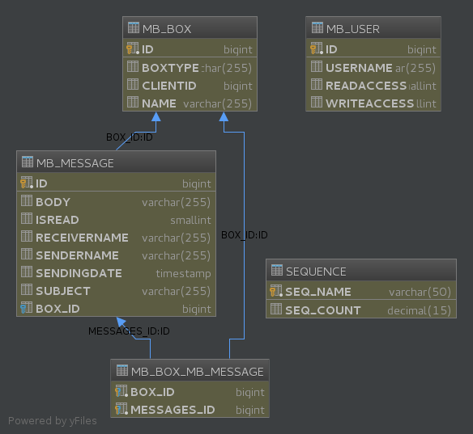

# Micro Project ASR/CSC5002

## Choix architecturaux

### Patrons de conceptions utilisés

* Synchronous-call
* Injection de dépendance (ou IoC)
* Factory


* Contract
* Vertical Decomposition
* Container (via glassfish/JEE)

### Utilisation de JMS

Nous avons choisi de ne pas utiliser JMS afin de pouvoir proposer,
de manière simple, une interface publique standard du web (interface REST).

JMS aurait été un très bon choix pour pouvoir proposer un service de *push* des
courriels vers le client (le client n'a pas besoin de vérifier régulièrement si
il a reçu de nouveau message, le serveur se charge de les lui envoyer en temps
réel). En contrepartie, l'utilisation de cette technologie nécessite de déployer
des services complémentaires (serveur de message comme RabbitMQ ou ActiveMQ) et
de gérer un système d'authentification. Il faudrait de plus prévoir une facade
entre le client et le serveur de message qui gère le *push* (ceci afin de ne pas
exposer publiquement le-dit serveur).

### Structures de données SQL



* **MB_BOX** représente une boite de réception de l'utilisateur *CLIENTID* (si
*BOXTYPE* contient `mailbox`) ou une newsbox (si *BOXTYPE* contient `newsbox`).
* **MB_MESSAGE** représente un message (un courriel) envoyé par *SERDERNAME*. Un
message est déposé dans une boite de reception (attribut *BOX_ID*).
* **SEQUENCE** est une table utilisé par eclipseLink pour génerer
automatiquement les id.

## *Directory Manager* et *Admin Client*


### Directory APIs

#### Lister tous les utilisateurs

HTTP: `GET /api/v1/directory/all`

En-tête HTTP:
```http
X-Client-ID: <your client id>
Accept: application/json
```

#### Créer un utilisateur

HTTP: `POST /api/v1/directory/create`

En-tête HTTP:
```http
X-Client-ID: <your client id>
Accept: application/json
```

Corps de message:
```json
{
  "name": "username",
  "permission": {
    "readAccess":true,
    "writeAccess":false
  }
}
```

#### Obtenir les droits d'un utilisateur

HTTP: `GET /api/v1/directory/{userId}`

En-tête HTTP:
```http
Accept: application/json
```

#### Modifier les droits d'un utilisateur

HTTP: `POST /api/v1/directory/{userId}`

En-tête HTTP:
```http
Accept: application/json
```

Corps de message:
```json
{
  "permission": {
    "readAccess":true,
    "writeAccess":false
  }
}
```

#### Supprimer un utilisateur

HTTP: `DELETE /api/v1/directory/{userId}`

## *Mailbox Manager* et *Mailbox Client*

### Structure du *Manager*

Cette application est composé en différente couche. Chacune de ces couches est
abstraite de celle l'utilisant (patron *Vertical decomposition*).

Ainsi les classes du package `api` sont les points d'entrées dans le programme
et sont définis via le standard Java JAX-RS. Ces classes transforme les exceptions
et données en code HTTP et représentation JSON respectivement.

Viens ensuite les classes du package `service` qui font les traitements métier et
vérification des données.

Le travail de persistence est laissé aux *DAO* (modèle de conception
*Data Access Object*) du package `persistence` qui se charge de sauvegarder les
entités dans la base de donnée et de remonter des exceptions en cas d'erreur.
ls permette aussi d'abstraire JPA des classes métiers (et nous permettrait de
changer facilement de méthode de persistence si nécessaire [passage à un PaaS]).

L'ensemble de ces services est relié ensemble via le méchanisme d'injection de
dépendance (patron de conception *Inversion of Control*) intégré à Jersey (`hk2`).
Ceci est configuré dans le package `config`.

### Explication de la configuration de Jersey

Notre application comporte une configuration (classes du package `config`) est
quelque peut particulière. Nous allons ici expliquer ce que fait chaque classes.

* `ApplicationConfiguration`: Il s'agit du point d'entré de la configuration JAX-RS.
C'est la classe qui est défini dans le `META-INF/web.xml`. La méthode `getClasses()`
retourne l'ensemble des classes qui vont faire parti de l'application et la méthode
`getSingletons()` retourne un set d'instance (et non de classe) qui feront parti de
l'application.
* `BinderFeature`: Cette classe permet de faire le lien entre les classes chargé par
Jersey (des `Feature`) et la classe enregistrant les *bindings* (définition des
dépendances pour l'*IoC*).
* `ApplicationBinder`: Déclaration de la résolution des dépendances. On associe
à chaque inteface une implémentation.

### Mailbox APIs

#### Lister toutes les boites de reception d'un utilisateur

HTTP: `GET /api/v1/mailbox`

En-tête HTTP:
```http
X-Client-ID: <your client id>
Accept: application/json
```

#### Créer une boite de réception

HTTP: `POST /api/v1/mailbox`

En-tête HTTP:
```http
X-Client-ID: <your client id>
Accept: application/json
```

Corps de message:
```json
{
  "name": "mb",
  "boxType": "mailbox"
}
```

#### Obtenir une boite de réception

HTTP: `GET /api/v1/mailbox/{mailboxId}`

En-tête HTTP:
```http
Accept: application/json
```

#### Supprimer une boite de réception

HTTP: `DELETE /api/v1/mailbox/{mailboxId}`

### Messages APIs

#### Obtenir tous les messages

HTTP: `GET /api/v1/message`

En-tête HTTP:
```http
X-Client-ID: <your client id>
Accept: application/json
```

#### Poster un message

HTTP: `POST /api/v1/message`

En-tête HTTP:
```http
X-Client-ID: <your client id>
Accept: application/json
```

Corps de message:
```json
{
  "senderName":"",
  "receiverName":"",
  "subject":"",
  "body":"",
  "box": {
    "id": 2751
  }
}
```

Note: seul le champ `box.id` est obligatoire.

#### Supprimer un message

HTTP: `DELETE /api/v1/message/{messageId}`

## Vérification des droits par *Mailbox Manager*

Le *Manager* permet de vérifier si un utilisateur à le droit de lire ou do poster
un message. Pour cela on utilise le service `remote.RightsService` qui permet
d'abstraire la dépendance au *Directory Manager*.

Ce service dispose de deux methode:
* `canPost(long clientId, Message msg)` permet de savoir si un client peut poster
le message donné.
* `canRead(long clientId, Box mailbox)` permet de savoir si un client peut lire
la boite de réception donné.


## Distribution des services

## Automatiiser le déploiement
